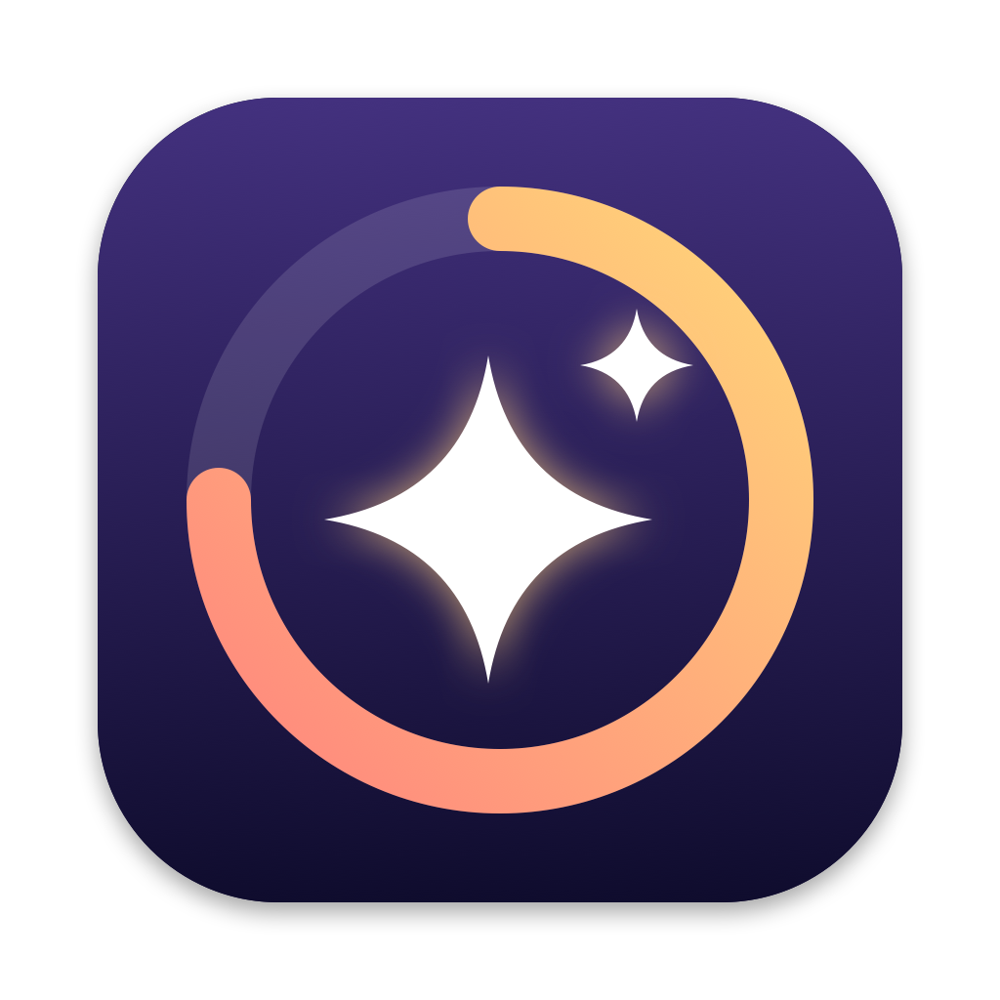

# FableUsage



macOS 메뉴바에 Claude **Fable 주간 한도 사용률**을 표시하고, 메뉴를 열면 이번 주 Fable을 어떤 Claude Code 세션이 얼마나 썼는지 보여주는 앱입니다.

- 메뉴바: Fable 주간 한도 % (서버가 경고 상태로 표시하면 주황/빨강)
- 메뉴: 플랜 한도(세션·주간·Fable), 사용처 비중, 세션별 Fable 사용량(가중 토큰), 실행 중 여부
- 세션 하위 메뉴: 재개 명령어 복사, 세션 ID 복사, Finder에서 폴더 열기
- Fable 한도가 80%를 넘으면 주기마다 한 번 알림

## 빌드 및 설치

Xcode 없이 Command Line Tools(`swiftc`)만 있으면 됩니다.

```sh
./build.sh
```

`~/Applications/FableUsage.app`에 설치하고 실행하며, 로그인 시 자동 실행을 등록합니다.

아이콘(`AppIcon.icns`)은 `icon/make_icon.swift`로 그린 것입니다. 수정한 뒤 `AppIcon.icns`를 지우고 `./build.sh`를 실행하면 다시 만들어집니다.

## 명령행 옵션

```sh
APP=~/Applications/FableUsage.app/Contents/MacOS/FableUsage
$APP --dump            # 한도와 세션별 사용량을 텍스트로 출력
$APP --login on|off    # 로그인 시 자동 실행 켜기/끄기
$APP --test-alert      # 테스트 알림 보내기, 알림 권한 상태 출력
```

## 동작 방식과 주의점

- **세션별 사용량**은 `~/.claude/projects/**/*.jsonl` 대화 기록에서 Fable 응답의 토큰 사용량을 모아 계산합니다. 새로 추가된 부분만 읽습니다.
  - 값은 가중 토큰(입력 1, 출력 5, 캐시 쓰기 1.25/2, 캐시 읽기 0.1)이며 실제 크레딧 차감과 같지 않을 수 있습니다.
  - 이 Mac의 Claude Code 기록만 포함합니다. claude.ai 채팅, Cowork, 다른 기기 사용분은 빠집니다.
- **플랜 한도**는 Claude Code의 `/usage`가 쓰는 `api.anthropic.com/api/oauth/usage`에서 가져옵니다.
  - 공개 문서가 없는 API라 응답 형식이 바뀌면 이 부분이 동작하지 않을 수 있습니다.
  - Claude Code가 키체인(`Claude Code-credentials`)에 저장한 토큰을 읽기만 하며, 갱신하거나 수정하지 않습니다. 토큰이 만료되면 Claude Code를 한 번 실행하면 됩니다.
- 한도를 가져오지 못하면 주 시작 시각으로 `main.swift`의 `resetWeekday`/`resetHour`(기본 일요일 06:00)를 씁니다.
- `build.sh`는 Command Line Tools에 오래된 `usr/include/swift/module.modulemap`이 남아 `import Cocoa`가 실패하는 경우, 해당 파일을 VFS overlay로 가려서 빌드합니다.
